# Overview


This Project is the Project #2 of the Udacity Azure Dev Ops Nanodegree to product a CI and CD process to deploy a web app through Azure App Services. This project comes with a preconfigred Python Flask app to predict housing prices based on the provided dataset.

# Project Plan
The project plan is very simple for this project and includes links to the Trello board so stalkholders and engineers can see the latest progess.

Link to Trello: [Trello Board](https://trello.com/b/8y0IeL22/udacity-project-2-flask-ml-app)

Here's a link to the Google Sheets Project plan.
[Google Sheets Project Plan](https://docs.google.com/spreadsheets/d/1Z_rSrHQZ0-z9kzYclgjnwL1CecLYfZZKeuzujpYVROY/edit?usp=sharing)


# Instructions

Architecture Diagram
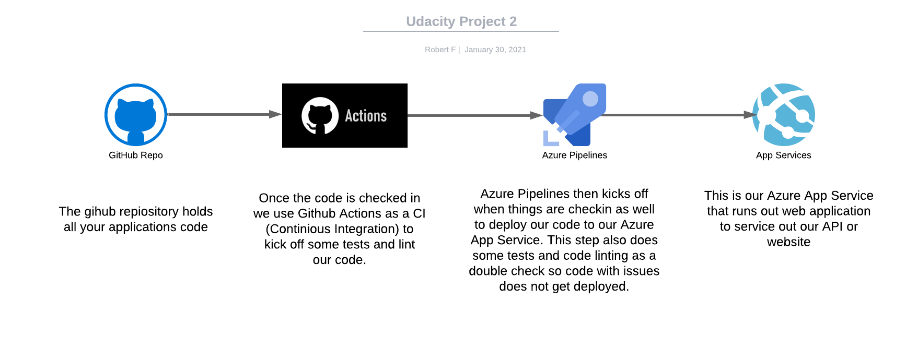

## Azure Cloud Shell Setup
Here's how to get the project running in the Azure Cloud shell. If you're running a linux based System such as Ubuntu or Mac OS then it should be very similar

1. Clone the Github Repo onto your perferred device or if you would perfer you can fork this repo and then clone it to your device.

2. Create a python Virtual Environment `python3 -m venv ~/.{project-name}`* this will create a virtial environment for your python app so packages and modules are not system wide so you can run many python projects without worrying about conflicts. Please replace the `{project-name}` with the a name of your choosing **Note* depending on your device it may be python or python3 as the python keyword.

3. Next you need to change directory to the repo name and then activate your neewly created enviroment like so
```
cd Udacity-DevOps-Project-2
source ~/.{project-name}/bin/activate
```

4. You will then we put into a terminal that is activated to your project like this image.
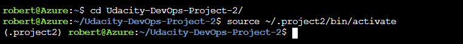

5. Now that the virtual environment is setup and active you can do a `make all` this will install the required modules from the requirements.txt file as well upgrade the pip installer. It will next run the linting step to lint our code and look for any formating and syntax errors as python is an interpreted language. After the linting it will run the testing scripts to test our code. At the end of the command you should be greated by the linting steps and the tests being passed.
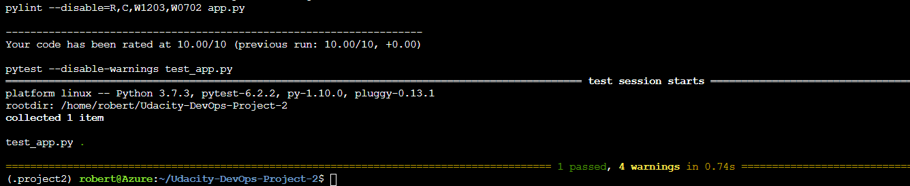


6. Now that all the code is installed and we've run our linting and testing steps now we can test the code locally ourselves. To run the code you can do `python3 app.py` this run our app in the Azure Cloud shell like in the image below
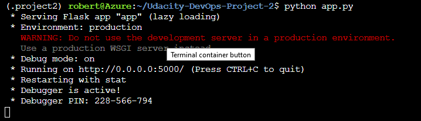

7. Now that our app is running locally in the Azure Cloud Shell you can access it by going to web preview in the Azure Cloud Shell and hit the configure button. It looks like a file with a magnifying glass icon.
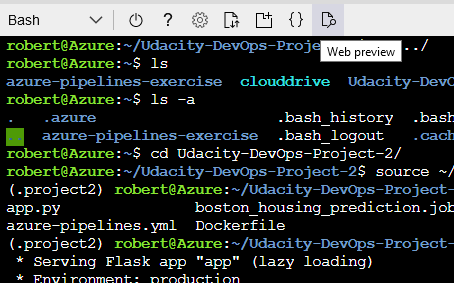
Once you've clicked on that icon you will be prompted to configure the web and the port. You then want to type int he port number that is in the screenshot which is port 5000. Once the port number is configured go ahead and click on the open and browse button.
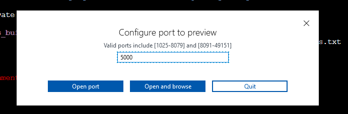
Onces you've open the preview you should be greeted with a web page just like this one below.
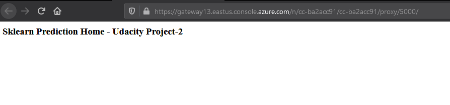

8. That's it for the Azure Cloud Shell setup, onto the Azure Web App Setup!

## Azure Web App Setup
In this portion of the setup we will configure the Web Application in our Azure Subscription! Super exciting stuff.

1. Firstly let's create a new resource group to hold our application, you can use either the Azure Portal or you can use the Azure CLI which I will demonstrate below.

2. Create the resource group `az group create -l eastus2 -n "udcaity-project2-rg"` This command will create a resource group in the East US 2 data center and it will be named "udcaity-project2-rg". I personally like to add the "-rg" to the end of the name to quickly tell I'm looking at a resource group.
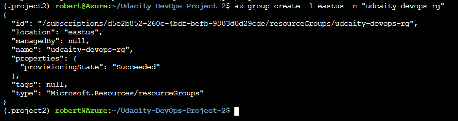

3. Before running this part, please make sure you are in the Azure Cloud shell and in the project directory and you've source activated the python. Now it's time to create the web app. To create the web app we run this command `az webapp up --sku F1 -l eastus2 -g "udcaity-project2-rg" -n "udacity-project2-app"` This create our web app in our newly created resource group, create our all in the East US 2 data center as well as name our application. This also spins up a App Services Plan in the free teir so you are not charged for the usage. This could take some time so make a cup of tea or take a break.
 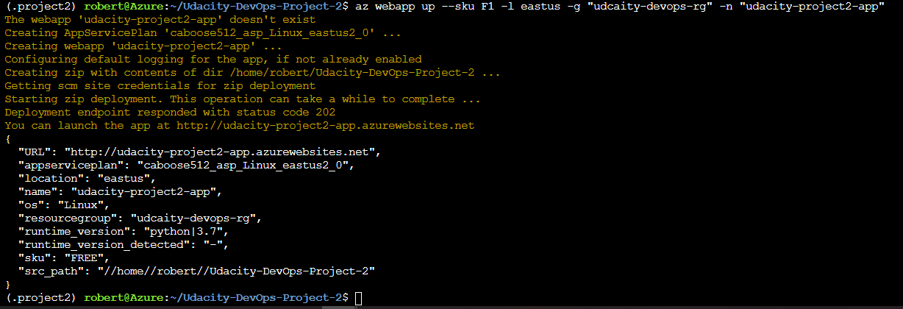

 *Note* if you have already created an app in this region you will get an error like the image below you may want to use that App service plan. To do that you can use this command instead which specifys your App Service plan name: `az webapp up --sku F1 -l eastus2 -g "udcaity-project2-rg" -p "app-service-plan-name-here" -n "udacity-project2-app"`
 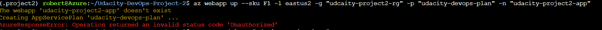

4. Now is the moment of truth, did your app deploy correctly? You can go to your web app through the Azure Portal interface by going to your app and find the URL here. You can also use the `az webapp browse` to launch a browser window to your application.
 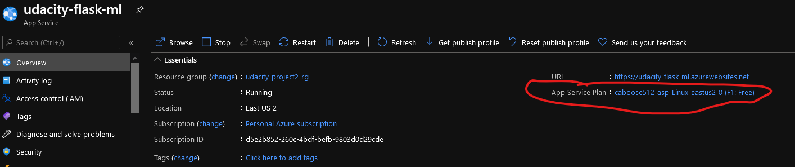

 5. Now you can go to your cloud shell again and change the "make_predict_azure_app.sh" this will send a curl command to the web application and return the result. To change the file you can edit the fil with this command `vi make_predict_azure_app.sh" this will open the file in a VIM editor. To edit press the I key and then scroll down to the bottom by using the arrow keys and change the name of the URL in the cURL command to your web app's address. To save and quit, hit the ESC key and then type `:wq` this will write the file and then quit out of VIM.

 6. You've edited the file so let's run the file you should have a similar output as the code below. `./make_predict_azure_app.sh`

```bash
udacity@Azure:~$ ./make_predict_azure_app.sh
Port: 443
{"prediction":[20.35373177134412]}
```
7. If you would to check the logs of your application you can see them using this command should see something like this below. `az webapp log tail -g "{resource-group-name}" -n "{app-name}"`
```bash
2021-01-30T22:02:44.432270007Z [2021-01-30 22:02:44,431] INFO in app: JSON payload: %s json_payload
2021-01-30T22:02:44.445898799Z [2021-01-30 22:02:44,445] INFO in app: inference payload DataFrame: %s inference_payload
2021-01-30T22:02:44.450650936Z [2021-01-30 22:02:44,446] INFO in app: Scaling Payload: %s payload
2021-01-30T22:02:44.465779072Z 172.16.0.1 - - [30/Jan/2021:22:02:44 +0000] "POST /predict HTTP/1.1" 200 35 "-" "curl/7.64.0"
```

Here is an example of what the predicition looks like in the Azure cloud shell after setting up the application in Azure.
 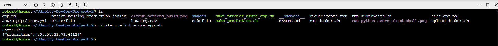

 ## Github Actions Step up
 Github actions should already be setup for this repo but let me show you how to set it up in your repositories for future use. Basically the Github actions will build the environment, lint our code and then test our code when anything is pushed to the master branch.

 1. Login into Github https://github.com/

 2. Locate your Repository you would like to setup Github Actions on.

 3. Located at the top of the repo there is a Actions tab

 4. You should be greated with a screen like this below
 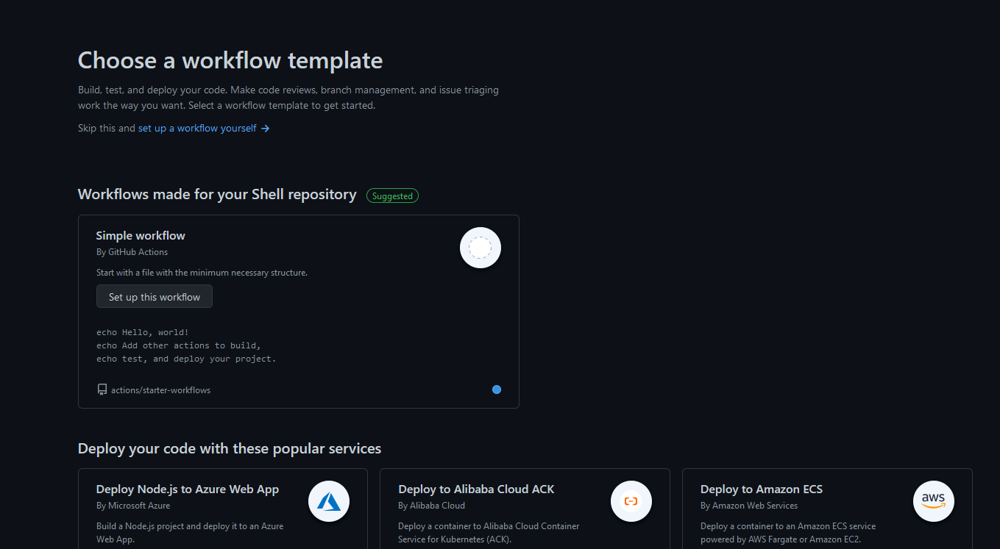
 You have a choice of tons of already configured github actions to do continious integration tasks or deplying your web app. For now though I'm going to click on the "set up a workflow yourself" link at the top of the page.

 5. You should be now greated by the YAML file editor where you can add sets to the build or new jobs as well. If you have a look at the .github/workflows/main.yml file in this repo you will see that we've setup a simple build step to setup the environment and install dependencies, then to lint our code and install test our code. And current this action runs when any code is pushed to the master branch as well as when there are any pull requests on the master branch as well.

 Here's an example of what a sucessfull Github Action build looks like:\
  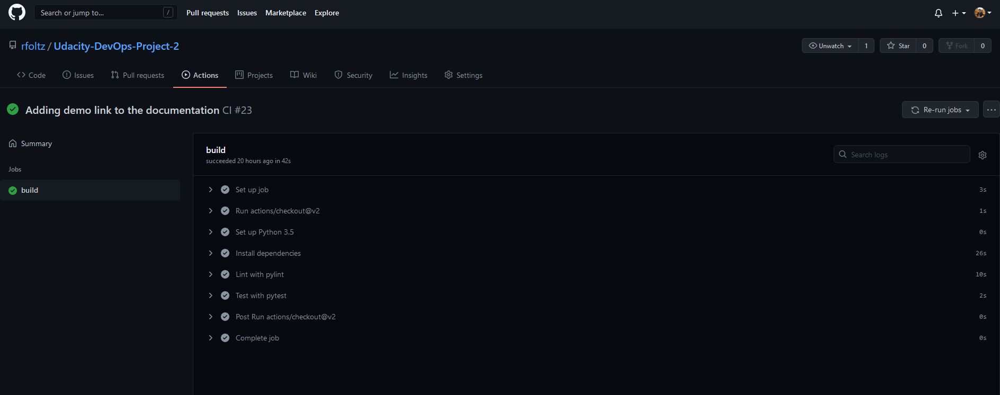


## Azure Pipelines Setup
This will show you show to create a new project in Azure DevOps portal and hook up to your Github account and create a service prinicple.

1. Goto https://dev.azure.com and click on the getting start free, if you don't already have an organization you will be prompted to make one. Once you've created your Azure DevOps account you can go ahead and create a new project.

2. Click on the top right and create a New Project
 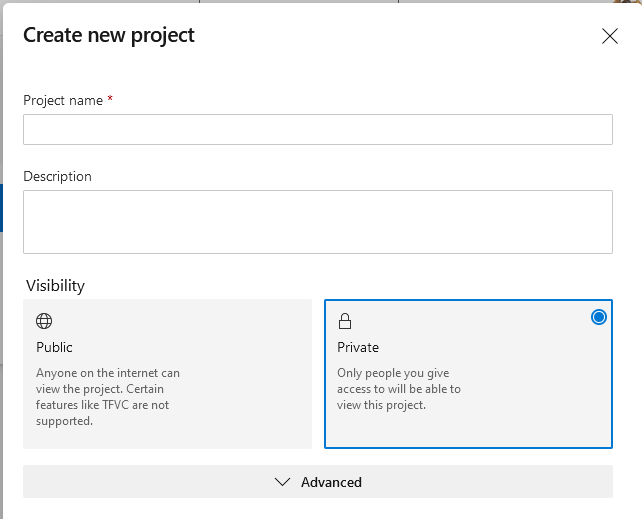

3. Once your project is created click on your project and select the Pipelines icon on the left had side. You will be prompted to configure where your code is coming from. Go ahead and click on Github, this should prompt you to connect your Github account to the Azure DevOps account. You can then either select if Azure Pipelines should have access to all of your repositories or to only select few. I personally selected only a select few.

4. Once the project is created it will walk you through the steps of selecting your respository, configuring the pipelines YAML file and then checking in the YAML file to your repo and then it will deploy your project to the select Azure resource. Which you can see in the pipelines tab of the Azure DevOps portal.
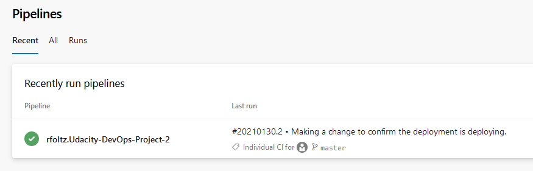


### Azure Pipelines Setup in Github if you've alreay connected your account.
Azure pipelines is also already setup for this project and my repository but to set this up for yoruself follow the steps below.

Now depending on how you setup Azure Pipelines in your Github account you repository may already have access to the Azure Pipelines configurator but if not you will have to go into your account settings like I did. I've configured Azure Pipelines to only have access to certain repositories.

1. Log into Github https://github.com/

2. Go to the top right and click on your account image. And then click on the settings link.


3. Once there in the list of the left hand side of the screen click on the Applications link. This will show you a list of application available to you click on the configure button on the Azure Pipelines application

4. Now select the repository that you would like to configure Azure Pipeline for

5. Once you save you should be prompted to log into your dev.azure.com account to access the pipelines in the Azure DevOps portal. Once logged in you will be prompted to select your Organization and either select an existing project or to create a new project. In the screenshot below I'm creating a new project as I don't have a project for this particular deployment. If you followed the steps in the Installing Azure Pipelines section you can just go ahead and select the existing project.
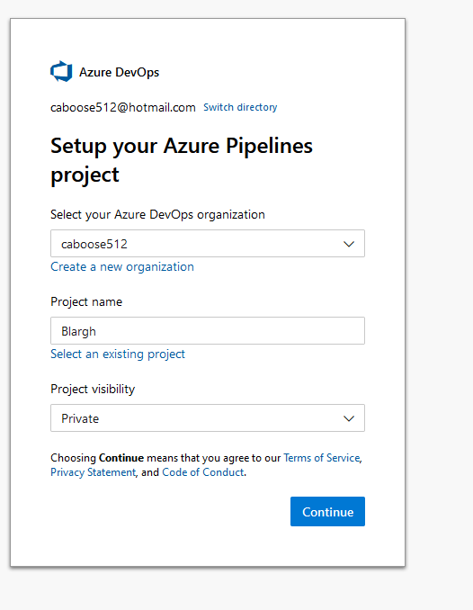

6. Once the project is created it will walk you through the steps of selecting your respository, configuring the pipelines YAML file and then checking in the YAML file to your repo and then it will deploy your project to the select Azure resource. Which you can see in the pipelines tab of the Azure DevOps portal.


For further reading you might want to take a look at the offical documentation to help. [Note the official documentation should be referred to and double checked as you setup CI/CD](https://docs.microsoft.com/en-us/azure/devops/pipelines/ecosystems/python-webapp?view=azure-devops).


## Tests
If you would like to run the tests during your development you can run the tests using the `pytest` command this will run all files that have the `test_` file naming convention.

When runing `pytest` you should see someting like this.


## Load Tests
Using the Python Library Locust we can perform a load test on our single predict endpoint.
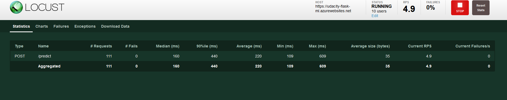

## Enhancements
Here lies a short list of possible future improvements to this project

- Better Tests in the Testing scripts
- Extending the Flask App to have new endpoints
- Adding additional parameters to the predict endpoint
    - Type of Housing (Condo, House, Attached or Dettached housing etc.)
    - Postal Code or Address to help predict closer housing prices in an area
- Flesh out load testing scenarios

## Demo 
Here's a link to the demo on Youtube
https://youtu.be/bSroTgsherY


